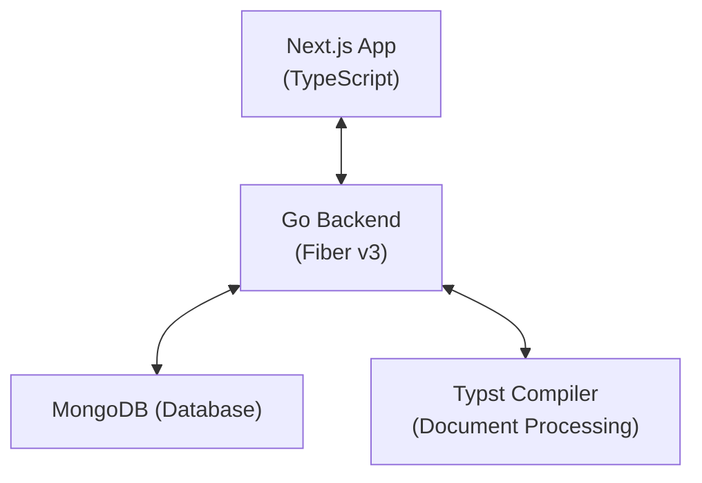

<div align="center">
  

# Caduceus

**Open-source collaborative Typst document editor**

[](https://opensource.org/licenses/MIT) [](https://nextjs.org/) [](https://golang.org/)

</div>

## 🌟 What is Caduceus?

**Caduceus** is a modern, open-source alternative to [Typst App](https://typst.app), providing a complete web-based environment for writing, editing, and compiling [Typst](https://github.com/typst) documents. Built with performance and collaboration in mind, Caduceus brings the power of professional typesetting to teams and individuals who value privacy, customization, and community-driven development.

<!-- ### ✨ Why Choose Caduceus?

| Feature           | Caduceus                       | Typst App             |
| ----------------- | ------------------------------ | --------------------- |
| **Open Source**   | ✅ Fully open source           | ❌ Proprietary        |
| **Self-Hosting**  | ✅ Host on your infrastructure | ❌ SaaS only          |
| **Privacy**       | ✅ Complete data control       | ⚠️ Limited control    |
| **Customization** | ✅ Modify to fit your needs    | ❌ Limited options    |
| **Cost**          | ✅ Free forever                | 💰 Subscription model |
| **Community**     | ✅ Community-driven            | ❌ Company-controlled | -->

## 🚀 Key Features

### 📝 **Professional Document Editing**

- **Syntax-highlighted editor** with intelligent Typst code completion
- **Live preview** with instant compilation feedback
- **Error diagnostics** with detailed explanations and suggestions
- **Multiple export formats** (PDF, PNG, SVG)
- **Template library** with academic and professional document templates

### 🤝 **Real-time Collaboration**

- **Multi-user editing** with operational transforms
- **Live cursors** and user presence indicators
- **Comment system** for document review and feedback
- **Version history** with diff visualization
- **Conflict resolution** for simultaneous edits

### 🏢 **Enterprise-Ready**

- **User management** with role-based access control
- **Project organization** with folders and tags
- **Team workspaces** for organization-wide collaboration
- **Integration APIs** for external tools and workflows
- **Single Sign-On (SSO)** support

### 🎨 **Modern User Experience**

- **Responsive design** optimized for desktop, tablet, and mobile
- **Dark/Light themes** with customizable color schemes
- **Accessibility compliant** (WCAG 2.1 AA)
- **Keyboard shortcuts** for power users
- **Progressive Web App** with offline editing capabilities

## 🏗️ Architecture

Caduceus follows a modern, scalable architecture designed for performance and maintainability:



### Frontend Stack

- **Framework**: Next.js 15.4.4 with App Router
- **Language**: TypeScript 5.0
- **Styling**: Tailwind CSS 4.0
- **UI Library**: HeroUI + Radix UI
- **State Management**: Zustand
- **Real-time**: Socket.IO Client
- **Editor**: Monaco Editor (VS Code engine)

### Backend Stack

- **Language**: Go 1.24.5
- **Framework**: Fiber v3 (Express-like performance)
- **Database**: MongoDB with transactions
- **Authentication**: JWT + OAuth2
- **Real-time**: WebSocket + Socket.IO
- **File Storage**: MinIO (S3-compatible)
- **Caching**: Redis

## 📦 Installation

### 🐳 Docker (Recommended)

The fastest way to get Caduceus running:

```bash
# Clone the repository
git clone https://github.com/Cierra-Runis/caduceus.git
cd caduceus

# Start with Docker Compose
docker-compose up -d

# Access at http://localhost:3000
```

### 🛠️ Manual Installation

#### Prerequisites

- **Node.js** 18+ and **pnpm** 10.13.1+
- **Go** 1.24.5+
- **MongoDB** 6.0+
- **Redis** 7.0+
- **Typst** compiler (latest)

#### Backend Setup

```bash
cd server

# Install dependencies
go mod download

# Set up environment
cp .env.example .env
# Edit .env with your configuration

# Run database migrations
go run ./cmd/migrate

# Start the server
go run main.go
```

#### Frontend Setup

```bash
cd app

# Install dependencies
pnpm install

# Set up environment
cp .env.local.example .env.local
# Edit .env.local with your configuration

# Start development server
pnpm dev
```

## 🔧 Configuration

### Environment Variables

#### Backend (`.env`)

```env
# Database
MONGO_URI=mongodb://localhost:27017
DB_NAME=caduceus
REDIS_URL=redis://localhost:6379

# Authentication
JWT_SECRET=your-super-secret-jwt-key
JWT_EXPIRY=24h

# Server
PORT=8080
FRONTEND_URL=http://localhost:3000

# File Storage
MINIO_ENDPOINT=localhost:9000
MINIO_ACCESS_KEY=minioadmin
MINIO_SECRET_KEY=minioadmin

# Typst
TYPST_BINARY_PATH=/usr/local/bin/typst
COMPILATION_TIMEOUT=30s
```

#### Frontend (`.env.local`)

```env
NEXT_PUBLIC_API_URL=http://localhost:8080
NEXT_PUBLIC_WS_URL=ws://localhost:8080
NEXT_PUBLIC_SITE_URL=http://localhost:3000
```

## 🧪 Development

### Running Tests

```bash
# Backend tests
cd server
go test -v -cover ./...

# Frontend tests
cd app
pnpm test
pnpm test:e2e
```

### Development Workflow

1. **Start the backend**:

   ```bash
   cd server && go run main.go
   ```

2. **Start the frontend**:

   ```bash
   cd app && pnpm dev
   ```

3. **Access the application**:
   - Frontend: <http://localhost:3000>
   - Backend API: <http://localhost:8080>
   - API Documentation: <http://localhost:8080/docs>

## 📚 Documentation

- **[API Documentation](docs/api.md)** - Complete REST API reference
- **[WebSocket Events](docs/websocket.md)** - Real-time communication protocol
- **[Deployment Guide](docs/deployment.md)** - Production deployment instructions
- **[Development Setup](docs/development.md)** - Detailed development environment setup
- **[Contributing Guide](CONTRIBUTING.md)** - How to contribute to the project

## 🗺️ Roadmap

### 🎯 Version 1.0 (Current)

- [ ] Basic Typst editor with syntax highlighting
- [ ] Real-time document compilation
- [ ] User authentication and project management
- [ ] Basic collaboration features
- [ ] PDF export

### 🚀 Version 1.1 (Q3 2025)

- [ ] Advanced collaboration (comments, suggestions)
- [ ] Template marketplace
- [ ] Plugin system
- [ ] Mobile app (React Native)
- [ ] Advanced search and filtering

### 🌟 Version 2.0 (Q1 2026)

- [ ] AI-powered writing assistance
- [ ] Advanced version control (Git integration)
- [ ] Enterprise SSO and LDAP support
- [ ] Advanced analytics and reporting
- [ ] Multi-language support

## 🤝 Contributing

We welcome contributions from developers of all skill levels! Here's how you can help:

### 🐛 **Found a Bug?**

[Open an issue](https://github.com/Cierra-Runis/caduceus/issues/new?template=bug_report.md) with detailed steps to reproduce.

### 💡 **Have a Feature Idea?**

[Submit a feature request](https://github.com/Cierra-Runis/caduceus/issues/new?template=feature_request.md) with your use case.

### 🔧 **Want to Code?**

1. Fork the repository
2. Create a feature branch (`git checkout -b feature/amazing-feature`)
3. Make your changes with tests
4. Commit using [Conventional Commits](https://conventionalcommits.org/)
5. Push and create a Pull Request

### 📖 **Improve Documentation**

Documentation improvements are always welcome! Edit files in `/docs` or improve inline comments.

## 🛡️ Security

Security is a top priority for Caduceus. If you discover a security vulnerability, please:

1. **DO NOT** open a public issue
2. Email <security@caduceus.dev> with details
3. Allow us 90 days to address the issue before public disclosure

See [SECURITY.md](SECURITY.md) for our full security policy.

## 📄 License

This project is licensed under the **MIT License** - see the [LICENSE](LICENSE) file for details.

## 👥 Community

Join our growing community:

<!-- - **[Discord](https://discord.gg/caduceus)** - Real-time chat and support -->

- **[GitHub Discussions](https://github.com/Cierra-Runis/caduceus/discussions)** - Long-form discussions
  <!-- - **[Twitter](https://twitter.com/caduceus_dev)** - Updates and announcements -->
  <!-- - **[Reddit](https://reddit.com/r/caduceus)** - Community discussions -->

## 🙏 Acknowledgments

- **[Typst Team](https://typst.app/)** - For creating an amazing typesetting system
- **[Monaco Editor](https://microsoft.github.io/monaco-editor/)** - Powering our code editor
- **[Go Fiber](https://gofiber.io/)** - High-performance web framework
- **[Next.js](https://nextjs.org/)** - React framework for production

---

<div align="center">
  <p><strong>Made with ❤️ by the open-source community</strong></p>
  <p>
    <a href="#-what-is-caduceus">About</a> •
    <a href="#-key-features">Features</a> •
    <a href="#-installation">Install</a> •
    <a href="#-documentation">Docs</a> •
    <a href="#-contributing">Contribute</a>
  </p>

**Star ⭐ this repository if you find it helpful!**

</div>
