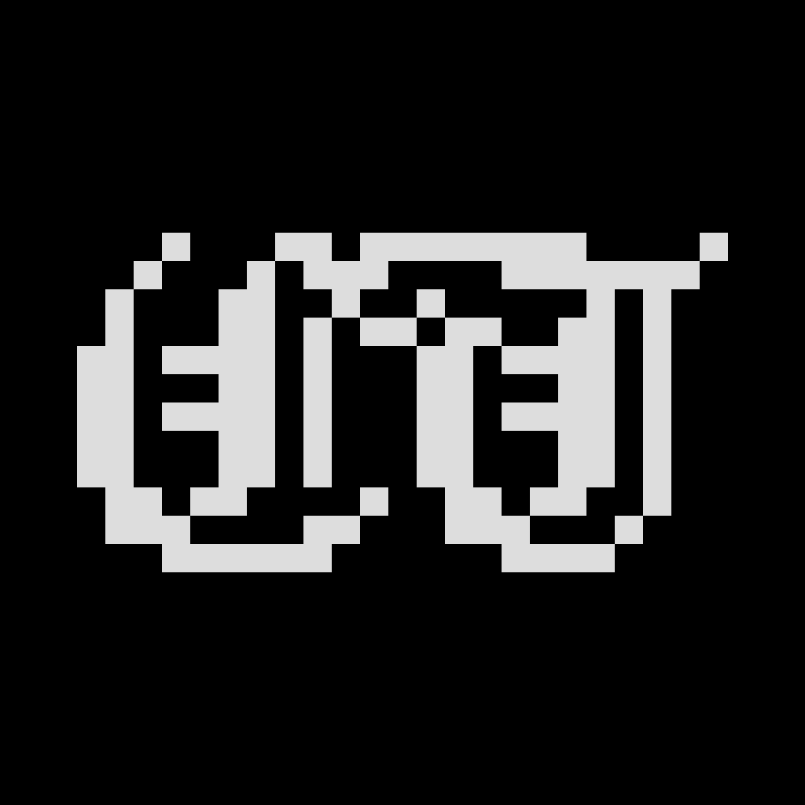

  

# Caduceus

**Open-source collaborative Typst document editor**

   

## 🌟 What is Caduceus?

**Caduceus** is a open-source alternative to [Typst App](https://typst.app). This project aims to provide a simple, self-hostable alternative for writing and compiling Typst documents in your browser.

> ⚠️ **Work in Progress**: This project is currently under active development. Many features are planned but not yet implemented.

## 📄 License

This project is licensed under the **MIT License** - see the [LICENSE](LICENSE) file for details.

---

**Star ⭐ this repository if you find it helpful!**

