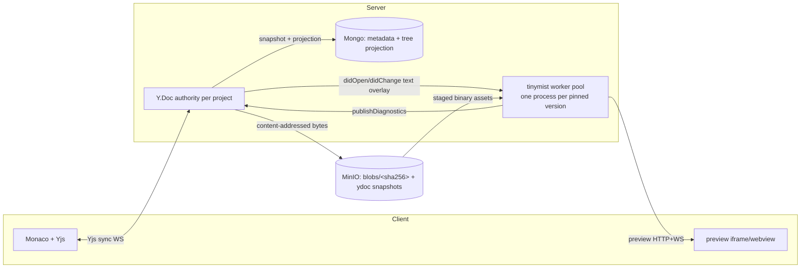

# Architecture — Server-Authoritative Compilation & Unified CRDT Project Model

Status: **proposed** (redesign). Supersedes the split described in
[File Storage](./File%20Storage.md) and the text-only room in `handler/ws.rs`.
The tinymist half of this document is backed by a working spike (see
[Compilation](#3-compilation-tinymist-workers)).

## Why redesign

Two problems with the model we have today drove this.

1. **Two sources of truth.** Structure (`Project.files`, `directories`,
   `entry`) lives in a Mongo document and is mutated over REST; text lives in a
   separate Yjs room keyed by **path**, seeded from Mongo on first connect.
   The two drift by construction:
   - Creating/renaming/deleting a file is a REST call the live room never sees
     (documented limitation: "newly-created text files … are not picked up by an
     already-live room until it re-seeds").
   - The room keys text by `path`, but a rename changes the path — so the CRDT
     key for a file is not stable, and a concurrent rename + edit can't merge.
   - `entry` is an id in Mongo but the room only knows paths.

2. **Compilation is a fragile client-side WASM sandbox.** The browser runs
   `typst.ts`, and every capability (fonts, diagnostics, `#image`/`#read`,
   version pinning) fights the sandbox — a long tail of bugs traced back to
   `typst.ts` quirks (font-book replacement, `diagnostics:'none'`, WASM
   re-init). It also cannot honor `Project.pinned_version`: the browser has one
   bundled Typst.

The redesign collapses structure **and** text into one CRDT, and moves
compilation to the server behind tinymist.

## North star

1. **id is identity; path is derived.** Every node (file *or* folder) has a
   stable id. Its path is computed from the parent chain. Renames/moves touch
   one field, never a key.
2. **One Y.Doc per project holds the whole tree + all text**, keyed by id. The
   server is the Yjs authority and the only writer to durable storage.
3. **No text/binary type split.** A file is bytes. "Editable as text" is a
   lazy, reversible overlay decided at open time, not a stored kind.
4. **Server-authoritative compilation** via tinymist worker **processes**, one
   per pinned Typst version, consumed over LSP + the preview protocol — never by
   linking tinymist's Rust internals.
5. **Content-addressed durable storage.** MinIO holds immutable blobs
   (`blobs/{sha256}`) and Y.Doc snapshots; Mongo holds metadata + a *rebuildable*
   projection of the tree for cheap REST listing.
6. **No dangling data.** Write-blob-before-reference on the way in; mark-and-
   sweep GC with a grace period on the way out.

## 1. Data model — one CRDT tree

The Y.Doc for a project contains:

- `nodes: Y.Map<NodeId, Y.Map>` — every node, file or folder, by id. Each node
  map holds:
  - `kind`: `"file" | "folder"`
  - `parent`: `NodeId | null` (null = project root)
  - `name`: string (a single path segment, not a full path)
  - `entry`: bool-ish marker is **not** here — see below.
  - files only: `blob`: `{ sha256, size }` — the durable bytes, or absent for a
    brand-new empty file whose bytes live only in `text` until first flush.
  - files only: `text`: `Y.Text` — present **iff** the file is currently opened
    as text (the overlay, §2). Absent for never-opened or binary-held files.
- `meta: Y.Map` — project-level fields that must merge like everything else:
  `entry: NodeId | null`, `pinnedVersion: string | null`.

Why this shape:

- **Path is derived** by walking `parent` to the root and joining `name`s. A
  rename is one `name` write; a move is one `parent` write. No key churn, and a
  concurrent rename+edit merges (they touch different fields of the same node).
- **Folders are real nodes**, so empty folders exist natively — no side
  `directories: string[]` list.
- **Uniqueness / path legality** (no `..`, no duplicate sibling name, no
  file-vs-folder collision) is validated by the server *before* it applies an
  incoming CRDT update, using the derived paths. Same rules as
  `models/path.rs`, enforced at the authority instead of at REST endpoints.
- **Ordering.** Sibling display order can use a fractional-index `order` field
  per node (LSEQ-style) if we want stable drag-reorder; v1 can sort by name.

### Consequences for existing code

- `Project.files: Vec<ProjectFile>`, `directories: Vec<String>`, the
  `FileContent::{Text,Binary}` enum, and `FileKind` all go away as the *source
  of truth*. They are replaced by the projection (§4).
- The REST file/folder endpoints (`POST /file`, `PATCH /file/{id}`, …) become
  thin: they translate to CRDT mutations applied by the authority, or are
  dropped in favor of the client mutating the Y.Doc directly (the server still
  validates every applied update). Either way there is one write path.

## 2. Bytes, not "text vs binary"

A file is bytes. Whether it is *editable as text* is a decision made when it is
opened, and it is reversible.

- **Open as text:** when a client opens a file, the server (or client) attempts
  a lazy decode of the blob: valid UTF-8, no NUL, under a size cap → materialize
  a `Y.Text` on the node seeded from the bytes. The file is now collaborative
  text. A user can also **force** "open as text" for a file that failed
  auto-detection (e.g. a `.typ` with an odd byte), and force "treat as binary"
  to drop the overlay.
- **Flush:** when the `Y.Text` is idle or on snapshot, the server encodes it to
  bytes, writes a new content-addressed blob, and updates the node's
  `blob = { sha256, size }`. The `Y.Text` may then be dropped from the doc
  (overlay is a cache), or kept while the file stays open.
- **Never-decoded files** (images, fonts, big data) simply keep their `blob` and
  have no `text`. `#image`/`#read` read their bytes from the staged workspace
  (§3).

This removes the entire class of "why is my README a dead binary" bugs — nothing
is *stored* as binary-vs-text; the overlay is presentation state.

Font family detection (`server/src/font.rs`, sfnt magic + `name` table) stays,
but becomes metadata attached to a node/blob rather than a `FileContent`
concern. Fonts are still fed to the compiler by family via the worker (§3),
not the browser.

## 3. Compilation — tinymist workers

**Validated by spike** (2026-07-23, tinymist v0.15.2 / Typst 0.15.0). Full
findings in the spike write-up; the load-bearing results:

- **Driving.** tinymist runs as a subprocess speaking LSP JSON-RPC over stdio.
  `initialize` → `tinymist.pinMain <abs path>` selects the compile entry →
  `publishDiagnostics` flow in **push** mode.
- **In-memory VFS.** `didOpen`/`didChange` overlay the compiler's world
  (`memory_changes: HashMap<Arc<Path>, Source>`). Verified: injecting a compile
  error into an entry buffer with **disk untouched** surfaced
  `unknown variable @…`, and breaking an imported file **purely in memory** made
  the error surface on the importing file (`unresolved import`). So we feed the
  CRDT's text nodes as LSP buffers with **zero disk writes on the edit hot
  path**.
- **Preview.** `tinymist.doStartPreview` starts an HTTP server (serves the
  self-contained typst-preview frontend) + a data-plane **WebSocket** streaming
  incremental vector-graphics updates. We proxy that WS to the browser (or embed
  the frontend). No Rust-internal coupling.
- **Position encoding is UTF-16** by default — the CRDT-offset ↔ LSP-position
  mapping must count UTF-16 code units.

### Obtaining & pinning the binary (non-obvious)

- `cargo install tinymist` yields **no binary** (the crates.io crate is
  library-only). npm `tinymist` is the WASM analyzer, not the server.
- The `tinymist` crate is **not usable as a Rust library dependency** either: it
  builds only against a **patched Typst fork** wired via the workspace
  `[patch.crates-io] typst = { git = "…/Myriad-Dreamin/typst.git", tag =
  "tinymist/v0.15.0" }`. Building against upstream crates.io `typst` fails.
- **Therefore:** we obtain tinymist by `git clone` + `cargo build -p
  tinymist-cli`, pinned to a tag, in the build image. This also *forces* the
  subprocess boundary — we could not embed it even if we wanted to, which is the
  north-star decision anyway.

### Version model

Each tinymist release compiles in exactly one Typst version (the binary reports
it at runtime). So `Project.pinnedVersion` maps to **which tinymist worker
binary** a project routes to. Multi-version support = build one `tinymist`
binary per supported version into the image and route by version. All offline
from git; no dependency on GitHub *release artifacts*.

### Feeding a project to a worker

Text is disk-free, but binary assets are not: the LSP overlay covers **text**
only. Files read as bytes (`#image`, fonts, `#read`, packages) are pulled by
tinymist's world from a **workspace directory**. So a worker gets:

- a materialized **workspace root** on disk where the server stages the
  project's binary blobs (fetched from MinIO by sha256) and the package cache;
- **text files overlaid live** via `didOpen`/`didChange` from the Y.Doc, so the
  hot path never hits disk;
- `pinMain(entry)` set from `meta.entry`; `doStartPreview` for the preview pin.

Open design choices (tracked, not blocking):

- Worker lifecycle: pool size, per-project vs shared-with-root-switching, idle
  eviction, crash restart.
- Debouncing CRDT text updates into `didChange`.
- Package-cache sharing across workers / a shared read-only volume.
- Whether binary assets can be fed without disk (likely not; plan for staging).

## 4. Persistence — Mongo projection + MinIO blobs & snapshots

- **MinIO is the durable store:**
  - `blobs/{sha256}` — immutable, content-addressed file bytes. Dedup is free;
    two files with identical content share one blob.
  - `ydoc/{project_id}/{seq}` — periodic Y.Doc snapshots (yrs update encoding),
    so a room can be rehydrated exactly (including CRDT history/tombstones)
    instead of re-seeded from text (which is what causes today's
    duplicate-content-on-rejoin hazard).
- **Mongo holds metadata + a rebuildable projection.** The `Project` document
  keeps ownership/name/timestamps and a *derived* tree projection: `[{ id,
  parentId, kind, name, blobSha, size, fontFamilies? }]` plus `entry`,
  `pinnedVersion`. This exists purely so REST listing and access checks don't
  need to load the Y.Doc. It is written by the authority whenever it snapshots,
  and can be **rebuilt from the latest Y.Doc snapshot** at any time — it is a
  cache, not the truth.

The room authority (`handler/ws.rs`, today text-only and path-keyed) is
rewritten to: apply+validate CRDT updates against derived paths, snapshot the
whole Y.Doc to MinIO, refresh the Mongo projection, and flush text→blob on
change. The current per-path text snapshot loop is replaced by the snapshot +
blob-flush model.

### No dangling data

- **Inbound (write-blob-before-reference):** to add/replace a file's bytes, the
  server writes `blobs/{sha256}` **first**, then records `blob.sha256` on the
  node. A crash between the two leaves an *unreferenced* blob (harmless, GC'd),
  never a *dangling reference* (a node pointing at absent bytes).
- **Outbound (mark-and-sweep with grace):** deleting a node or replacing its
  bytes does **not** delete the blob — other nodes/projects/snapshots may share
  that sha. A periodic GC marks all sha256 reachable from every project's live
  Y.Doc + retained snapshots, and sweeps `blobs/*` not seen, **subject to a grace
  period** (min-age, e.g. 24 h) so a blob written seconds before its reference
  is committed is never swept mid-flight.
- Content-addressing makes this safe: a blob is defined only by its bytes, so
  concurrent writers of the same content converge instead of racing.

## 5. Migration

The change is large but stageable; each stage is shippable.

1. **Blobs first.** Introduce `blobs/{sha256}` alongside today's
   `projects/{id}/{storage_key}`. New uploads write content-addressed; a
   backfill re-keys existing binaries. `ObjectStore` grows a content-addressed
   put; the trait shape is unchanged.
2. **Unified Y.Doc, dual-write.** Stand up the id-keyed tree Y.Doc and the
   snapshot store; keep writing the Mongo projection so REST keeps working.
   Migrate the client room from path-keyed `Y.Text` to id-keyed nodes.
3. **tinymist worker service.** Add the worker pool + LSP bridge + preview
   proxy behind a flag; move preview/diagnostics off the browser WASM path.
   Drop `app/src/lib/typst.ts` client compile once at parity.
4. **Retire the split model.** Remove `FileContent::{Text,Binary}`,
   `directories`, and the REST-mutates-structure path once the CRDT is the sole
   writer.

## Open questions

- Sibling ordering: fractional index now, or name-sort until drag-reorder is
  needed?
- Snapshot cadence & retention (how many `ydoc/{id}/{seq}` to keep; compaction).
- Worker pool sizing and isolation (one project per process vs root-switching).
- Access model for packages (`@preview/*`): shared cache volume, network policy.
- Whether the client mutates the Y.Doc directly (server validates) or all
  structure mutations still go through a server API that applies them.
