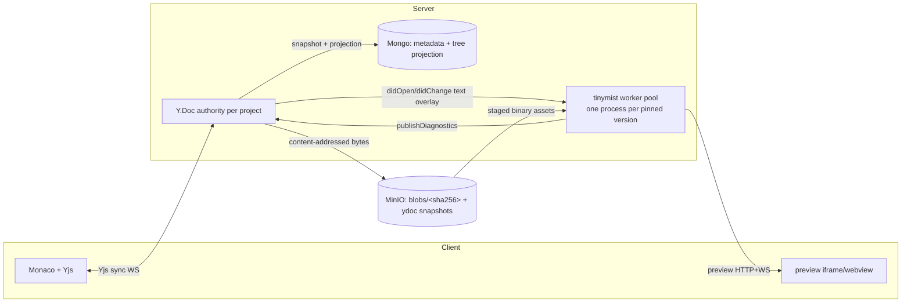

# Architecture — Server-Authoritative Compilation & Unified CRDT Project Model

Status: **half-built.** The *project-model* half of this document (the id-keyed
CRDT tree, content-addressed blobs, Y.Doc snapshots, the rebuildable Mongo
projection, the reversible text overlay, and GC) is **implemented on `dev`** —
see [Project Persistence](./Project%20Persistence.md) for the as-built model.
The *compilation* half (§3, tinymist workers) is **not built**; it is the
current design target, backed by a working spike, with the open choices resolved
in [Implementation status](#implementation-status--decisions-2026-07) below.

> The prose in §1–§2 and §4 is the original redesign proposal, kept for
> rationale. Where the as-built code deviates, the reconciliation table in
> [Implementation status](#implementation-status--decisions-2026-07) is
> authoritative.

## Why redesign

Two problems with the model we have today drove this.

1. **Two sources of truth.** Structure (`Project.files`, `directories`,
   `entry`) lives in a Mongo document and is mutated over REST; text lives in a
   separate Yjs room keyed by **path**, seeded from Mongo on first connect.
   The two drift by construction:
   - Creating/renaming/deleting a file is a REST call the live room never sees
     (documented limitation: "newly-created text files … are not picked up by an
     already-live room until it re-seeds").
   - The room keys text by `path`, but a rename changes the path — so the CRDT
     key for a file is not stable, and a concurrent rename + edit can't merge.
   - `entry` is an id in Mongo but the room only knows paths.

2. **Compilation is a fragile client-side WASM sandbox.** The browser runs
   `typst.ts`, and every capability (fonts, diagnostics, `#image`/`#read`,
   version pinning) fights the sandbox — a long tail of bugs traced back to
   `typst.ts` quirks (font-book replacement, `diagnostics:'none'`, WASM
   re-init). It also cannot honor `Project.pinned_version`: the browser has one
   bundled Typst.

The redesign collapses structure **and** text into one CRDT, and moves
compilation to the server behind tinymist.

## North star

1. **id is identity; path is derived.** Every node (file *or* folder) has a
   stable id. Its path is computed from the parent chain. Renames/moves touch
   one field, never a key.
2. **One Y.Doc per project holds the whole tree + all text**, keyed by id. The
   server is the Yjs authority and the only writer to durable storage.
3. **No text/binary type split.** A file is bytes. "Editable as text" is a
   lazy, reversible overlay decided at open time, not a stored kind.
4. **Server-authoritative compilation** via tinymist worker **processes**, one
   per pinned Typst version, consumed over LSP + the preview protocol — never by
   linking tinymist's Rust internals.
5. **Content-addressed durable storage.** MinIO holds immutable blobs
   (`blobs/{sha256}`) and Y.Doc snapshots; Mongo holds metadata + a *rebuildable*
   projection of the tree for cheap REST listing.
6. **No dangling data.** Write-blob-before-reference on the way in; mark-and-
   sweep GC with a grace period on the way out.

```mermaid
flowchart LR
  subgraph Client
    Editor[Monaco + Yjs]
    Preview[preview iframe/webview]
  end
  subgraph Server
    Room[Y.Doc authority per project]
    Proj[(Mongo: metadata + tree projection)]
    Worker[tinymist worker pool<br/>one process per pinned version]
  end
  Blobs[(MinIO: blobs/&lt;sha256&gt; + ydoc snapshots)]

  Editor <-->|Yjs sync WS| Room
  Room -->|snapshot + projection| Proj
  Room -->|content-addressed bytes| Blobs
  Room -->|didOpen/didChange text overlay| Worker
  Blobs -->|staged binary assets| Worker
  Worker -->|publishDiagnostics| Room
  Worker -->|preview HTTP+WS| Preview
```

## Implementation status & decisions (2026-07)

### What is built vs pending

| Area | Proposed here | As built on `dev` |
| --- | --- | --- |
| id-keyed tree, folders as nodes, path derived | §1 | **Done** (`models::tree`, `crdt`) |
| server-authoritative validation (cycles, dupes) | §1 | **Done** (`reconcile_tree` in `handler/ws.rs`) |
| bytes-not-text, reversible overlay | §2 | **Done** — overlay is a per-file `Y.Text`; idle eviction **strips** overlays whose bytes match their blob and **rematerializes** from blobs on rejoin (a refinement of §2's "drop the overlay") |
| content-addressed blobs, write-before-reference | §4 | **Done** (`storage::ProjectStore`) |
| Y.Doc snapshot + rebuildable Mongo projection | §4 | **Done** — but a single `ydoc` snapshot per project, **no `{seq}` history** yet |
| mark-sweep GC with grace | §4 | **Done, partial** — project-scoped two-pass sweep over **live rooms only**; a cold-project sweep isn't wired |
| `files.autoSave` blob-flush policy | — (new) | **Done** — client-driven flush replaced the settle heuristic |
| idle room eviction | — (new) | **Done** (`empty_since` + evict tick) |
| **tinymist workers (LSP + preview)** | §3 | **Not built** — the work this doc now tracks |
| `Project.pinnedVersion` field | §1 `meta` | **Not built** — needed for version→worker routing |
| client `lib/typst.ts` WASM compile | to retire | **Still the preview path** (retired only at P2 parity) |

The as-built model is documented in
[Project Persistence](./Project%20Persistence.md); this doc is now primarily the
**compilation** design (§3) plus the [status surfaces](#6-editor-status-surfaces)
that its diagnostics light up.

### Decisions taken

1. **LSP first, preview later.** P1 ships tinymist for **diagnostics + language
   intelligence only**, keeping the client WASM preview. Server-side preview
   (retiring `lib/typst.ts`) is P2. Smallest blast radius for the biggest UX
   jump.
2. **Multi-version from the start.** `Project.pinnedVersion` lands with P1, and
   the build image carries **one `tinymist` binary per supported Typst version**;
   a project routes to the worker for its pinned version. (Single-version was
   the cheaper alternative; we chose completeness because pinning is load-bearing
   for reproducible output.)
3. **One worker per live room, bound to the room lifecycle.** Not a shared pool
   with root-switching — spawn lazily on first need, tear down on room eviction
   (reuse the `empty_since`/evict machinery), restart on crash.
4. **Multi-client LSP: the room owns the document; browsers issue queries.** See
   §3's [Multi-client LSP](#multi-client-lsp-the-crux) — the part the original
   proposal left unspecified.

## 1. Data model — one CRDT tree

The Y.Doc for a project contains:

- `nodes: Y.Map<NodeId, Y.Map>` — every node, file or folder, by id. Each node
  map holds:
  - `kind`: `"file" | "folder"`
  - `parent`: `NodeId | null` (null = project root)
  - `name`: string (a single path segment, not a full path)
  - `entry`: bool-ish marker is **not** here — see below.
  - files only: `blob`: `{ sha256, size }` — the durable bytes, or absent for a
    brand-new empty file whose bytes live only in `text` until first flush.
  - files only: `text`: `Y.Text` — present **iff** the file is currently opened
    as text (the overlay, §2). Absent for never-opened or binary-held files.
- `meta: Y.Map` — project-level fields that must merge like everything else:
  `entry: NodeId | null`, `pinnedVersion: string | null`.

Why this shape:

- **Path is derived** by walking `parent` to the root and joining `name`s. A
  rename is one `name` write; a move is one `parent` write. No key churn, and a
  concurrent rename+edit merges (they touch different fields of the same node).
- **Folders are real nodes**, so empty folders exist natively — no side
  `directories: string[]` list.
- **Uniqueness / path legality** (no `..`, no duplicate sibling name, no
  file-vs-folder collision) is validated by the server *before* it applies an
  incoming CRDT update, using the derived paths. Same rules as
  `models/path.rs`, enforced at the authority instead of at REST endpoints.
- **Ordering.** Sibling display order can use a fractional-index `order` field
  per node (LSEQ-style) if we want stable drag-reorder; v1 can sort by name.

### Consequences for existing code

- `Project.files: Vec<ProjectFile>`, `directories: Vec<String>`, the
  `FileContent::{Text,Binary}` enum, and `FileKind` all go away as the *source
  of truth*. They are replaced by the projection (§4).
- The REST file/folder endpoints (`POST /file`, `PATCH /file/{id}`, …) become
  thin: they translate to CRDT mutations applied by the authority, or are
  dropped in favor of the client mutating the Y.Doc directly (the server still
  validates every applied update). Either way there is one write path.

## 2. Bytes, not "text vs binary"

A file is bytes. Whether it is *editable as text* is a decision made when it is
opened, and it is reversible.

- **Open as text:** when a client opens a file, the server (or client) attempts
  a lazy decode of the blob: valid UTF-8, no NUL, under a size cap → materialize
  a `Y.Text` on the node seeded from the bytes. The file is now collaborative
  text. A user can also **force** "open as text" for a file that failed
  auto-detection (e.g. a `.typ` with an odd byte), and force "treat as binary"
  to drop the overlay.
- **Flush:** when the `Y.Text` is idle or on snapshot, the server encodes it to
  bytes, writes a new content-addressed blob, and updates the node's
  `blob = { sha256, size }`. The `Y.Text` may then be dropped from the doc
  (overlay is a cache), or kept while the file stays open.
- **Never-decoded files** (images, fonts, big data) simply keep their `blob` and
  have no `text`. `#image`/`#read` read their bytes from the staged workspace
  (§3).

This removes the entire class of "why is my README a dead binary" bugs — nothing
is *stored* as binary-vs-text; the overlay is presentation state.

Font family detection (`server/src/font.rs`, sfnt magic + `name` table) stays,
but becomes metadata attached to a node/blob rather than a `FileContent`
concern. Fonts are still fed to the compiler by family via the worker (§3),
not the browser.

## 3. Compilation — tinymist workers

**Validated by spike** (2026-07-23, tinymist v0.15.2 / Typst 0.15.0). Full
findings in the spike write-up; the load-bearing results:

- **Driving.** tinymist runs as a subprocess speaking LSP JSON-RPC over stdio.
  `initialize` → `tinymist.pinMain <abs path>` selects the compile entry →
  `publishDiagnostics` flow in **push** mode.
- **In-memory VFS.** `didOpen`/`didChange` overlay the compiler's world
  (`memory_changes: HashMap<Arc<Path>, Source>`). Verified: injecting a compile
  error into an entry buffer with **disk untouched** surfaced
  `unknown variable @…`, and breaking an imported file **purely in memory** made
  the error surface on the importing file (`unresolved import`). So we feed the
  CRDT's text nodes as LSP buffers with **zero disk writes on the edit hot
  path**.
- **Preview.** `tinymist.doStartPreview` starts an HTTP server (serves the
  self-contained typst-preview frontend) + a data-plane **WebSocket** streaming
  incremental vector-graphics updates. We proxy that WS to the browser (or embed
  the frontend). No Rust-internal coupling.
- **Position encoding is UTF-16** by default — the CRDT-offset ↔ LSP-position
  mapping must count UTF-16 code units.

### Multi-client LSP (the crux)

LSP was designed for **one** editor owning documents via
`didOpen`/`didChange`/`didClose`. We have **N browsers** editing one shared CRDT
doc. The original proposal said "feed the CRDT's text nodes as LSP buffers" but
did not resolve who owns those buffers when there are many editors. The model:

- **The room is the sole document owner.** The room manager already holds the
  authoritative overlay text, and it is the *only* thing that issues
  `didOpen`/`didChange`/`didClose` to the worker: `didOpen` every text file on
  worker spawn (id → VFS path); on each CRDT text update, a **debounced**
  `didChange` for the affected file; on rename/move, the VFS path changes →
  close+open; binary create/change → restage the blob to the workspace dir (no
  LSP). One writer, exactly as for durable storage.
- **Browsers issue *queries*, not edits, to the LSP.** Each browser runs
  `monaco-languageclient` with its document **sync suppressed** (the room owns
  sync) but its **requests** — completion, hover, signatureHelp, definition,
  references, documentSymbol, formatting, semantic tokens — forwarded over a
  per-connection **`/ws/project/{id}/lsp`** socket (JWT-authed like the collab
  socket) to a bridge that relabels the request's uri to the room's VFS path,
  hits the one worker, and returns the response to *that* browser. Requests
  fan-in to one worker; the document has one owner.
- **Position consistency.** A completion carries a position in the *browser's*
  buffer; the worker answers against the *room's* last `didChange`. **P1:
  fire-and-remap** — the user's own edits already round-trip through the room
  fast and completion re-fires as they type, so transient staleness self-heals.
  **Hardening (P3):** tag each request with the client's Yjs state vector and
  have the bridge dispatch only once the worker is `didChange`'d up to ≥ that
  version (bounded wait, else best-effort).
- **Diagnostics are room state, not per-client.** `publishDiagnostics` → bridge
  → **broadcast to every room connection** → squiggles + the shared diagnostics
  store that lights up the [status surfaces](#6-editor-status-surfaces) (tabs,
  tree, status bar, Problems panel). Never routed to a single client.

### Obtaining & pinning the binary (non-obvious)

- `cargo install tinymist` yields **no binary** (the crates.io crate is
  library-only). npm `tinymist` is the WASM analyzer, not the server.
- The `tinymist` crate is **not usable as a Rust library dependency** either: it
  builds only against a **patched Typst fork** wired via the workspace
  `[patch.crates-io] typst = { git = "…/Myriad-Dreamin/typst.git", tag =
  "tinymist/v0.15.0" }`. Building against upstream crates.io `typst` fails.
- **Therefore:** we obtain tinymist by `git clone` + `cargo build -p
  tinymist-cli`, pinned to a tag, in the build image. This also *forces* the
  subprocess boundary — we could not embed it even if we wanted to, which is the
  north-star decision anyway.

### Version model

Each tinymist release compiles in exactly one Typst version (the binary reports
it at runtime). So `Project.pinnedVersion` maps to **which tinymist worker
binary** a project routes to. Multi-version support = build one `tinymist`
binary per supported version into the image and route by version. All offline
from git; no dependency on GitHub *release artifacts*.

### Feeding a project to a worker

Text is disk-free, but binary assets are not: the LSP overlay covers **text**
only. Files read as bytes (`#image`, fonts, `#read`, packages) are pulled by
tinymist's world from a **workspace directory**. So a worker gets:

- a materialized **workspace root** on disk where the server stages the
  project's binary blobs (fetched from MinIO by sha256) and the package cache;
- **text files overlaid live** via `didOpen`/`didChange` from the Y.Doc, so the
  hot path never hits disk;
- `pinMain(entry)` set from `meta.entry`; `doStartPreview` for the preview pin.

Resolved (see [Decisions](#decisions-taken)):

- **Worker lifecycle** — one worker per live room, bound to the room's
  `empty_since`/evict lifecycle; lazy spawn on first LSP/preview need; restart on
  crash (re-`didOpen` from the current overlay). The
  [room-introspection endpoint](./Project%20Persistence.md) (`GET
  /api/admin/rooms`) grows worker fields (pid, version, last-compile ms, diag
  counts) so a room and its worker debug as one view.
- **Version routing** — `Project.pinnedVersion` → worker binary; one binary per
  supported version baked into the image.
- **Binary assets** — staged to the workspace dir on disk (the LSP overlay is
  text-only); confirmed by the spike.

Still open (tracked, not blocking P1):

- `didChange` debounce window (start ~200 ms; tune against typing latency).
- Package-cache volume: shared read-only mount across workers, and the network
  policy for first-fetch of `@preview/*`.
- Position-sync hardening (the version-gated dispatch above) — P3.
- Preview fan-out shape at P2: one server SVG stream per room proxied to every
  client vs per-client preview pins.

## 4. Persistence — Mongo projection + MinIO blobs & snapshots

- **MinIO is the durable store:**
  - `blobs/{sha256}` — immutable, content-addressed file bytes. Dedup is free;
    two files with identical content share one blob.
  - `ydoc/{project_id}/{seq}` — periodic Y.Doc snapshots (yrs update encoding),
    so a room can be rehydrated exactly (including CRDT history/tombstones)
    instead of re-seeded from text (which is what causes today's
    duplicate-content-on-rejoin hazard).
- **Mongo holds metadata + a rebuildable projection.** The `Project` document
  keeps ownership/name/timestamps and a *derived* tree projection: `[{ id,
  parentId, kind, name, blobSha, size, fontFamilies? }]` plus `entry`,
  `pinnedVersion`. This exists purely so REST listing and access checks don't
  need to load the Y.Doc. It is written by the authority whenever it snapshots,
  and can be **rebuilt from the latest Y.Doc snapshot** at any time — it is a
  cache, not the truth.

The room authority (`handler/ws.rs`, today text-only and path-keyed) is
rewritten to: apply+validate CRDT updates against derived paths, snapshot the
whole Y.Doc to MinIO, refresh the Mongo projection, and flush text→blob on
change. The current per-path text snapshot loop is replaced by the snapshot +
blob-flush model.

### No dangling data

- **Inbound (write-blob-before-reference):** to add/replace a file's bytes, the
  server writes `blobs/{sha256}` **first**, then records `blob.sha256` on the
  node. A crash between the two leaves an *unreferenced* blob (harmless, GC'd),
  never a *dangling reference* (a node pointing at absent bytes).
- **Outbound (mark-and-sweep with grace):** deleting a node or replacing its
  bytes does **not** delete the blob — other nodes/projects/snapshots may share
  that sha. A periodic GC marks all sha256 reachable from every project's live
  Y.Doc + retained snapshots, and sweeps `blobs/*` not seen, **subject to a grace
  period** (min-age, e.g. 24 h) so a blob written seconds before its reference
  is committed is never swept mid-flight.
- Content-addressing makes this safe: a blob is defined only by its bytes, so
  concurrent writers of the same content converge instead of racing.

## 5. Migration

The change is large but stageable; each stage is shippable. Stages 1–2 and 4
are **done**; the tinymist service is the remaining work, sub-phased.

1. ~~**Blobs first.**~~ **Done** — content-addressed `blobs/{sha256}`.
2. ~~**Unified Y.Doc.**~~ **Done** — id-keyed tree Y.Doc + snapshot store +
   rebuildable Mongo projection; the room is id-keyed.
3. **tinymist service** *(pending — the current work)*, itself phased:
   - **P1 — LSP only.** One worker subprocess per live room (latest version to
     start, then `pinnedVersion` routing), the LSP-over-WS bridge, diagnostics
     fan-out, and completion/hover in Monaco. **Client WASM preview stays.**
   - **P2 — server preview.** `doStartPreview` SVG streaming proxied to clients;
     retire `app/src/lib/typst.ts`; server-provisioned fonts/packages.
   - **P3 — depth.** Rename / goto-def / references / formatting, server-side
     PDF export, and version-gated position dispatch.
4. ~~**Retire the split model.**~~ **Done** — `Project.files`,
   `FileContent::{Text,Binary}`, and the REST-mutates-structure path are gone;
   the CRDT is the sole writer.

## 6. Editor status surfaces

The unsaved-changes dot on a tab is one instance of a general need: **ambient,
glanceable state**. Today the editor surfaces only the unsaved dot (tabs),
presence avatars, upload progress (dialog), and a raw compile-error string.
Notably absent is **connection / sync state**, which the `WebsocketProvider`
already emits (`status`, `sync`) but nothing renders. Three tiers:

1. **A bottom status bar** (`<StatusBar/>`, VS Code-style) — the home for global
   ambient state:

   | Segment | States | Source | Needs tinymist? |
   | --- | --- | --- | --- |
   | Connection / sync | `● Live` / `⟳ Syncing…` / `⚠ Reconnecting` | provider `status`+`sync` | no |
   | Collaborators | `👥 3` → presence popover | awareness | no |
   | Save | `Saved` / `Saving…` / `Unsaved · autosave: onFocusChange` | flush lifecycle + `settings` | no |
   | Cursor | `Ln 12, Col 5` (+ selection) | Monaco | no |
   | Entry · mode | `main.typ · Typst` | tree `entry` | no |
   | Compile | `✓ 0.8s` / `⟳…` / `✕ 2 · ⚠ 1` → Problems | compile status | rich counts: **yes** |

2. **Per-file decorations** (tabs + tree) — generalize the dot: dirty dot
   *(done)*, **problem badge** (error/warn counts — needs tinymist), upload /
   compile spinner, binary / read-only glyph, and a "someone else is editing"
   mini-avatar (awareness already tracks who focuses which file).

3. **A Problems panel** (collapsible) — diagnostics grouped by file, click to
   jump. Lit by tinymist.

**Split by dependency.** Connection / save / cursor / collaborators need **no
backend work** and ship first (a `useConnectionStatus(provider)` hook + the
status bar shell). The problem badges and Problems panel are fed by the
**diagnostics store** that tinymist P1 fills — so the status roadmap and the
tinymist roadmap converge on the same shared store.

## Open questions

- Sibling ordering: fractional index now, or name-sort until drag-reorder is
  needed? *(still open — currently name-sorted.)*
- Snapshot retention & compaction (the snapshot is a single `ydoc` today; no
  history/`{seq}` yet).
- Cold-project GC: the sweep runs only against live rooms, so an evicted
  project's orphan blobs aren't reclaimed.
- Access model for packages (`@preview/*`): shared cache volume, network policy.

*Resolved since the original draft:* worker isolation is **one per live room**
(see [Decisions](#decisions-taken)); the client **mutates the Y.Doc directly**
and the server validates each applied update (`reconcile_tree`).
