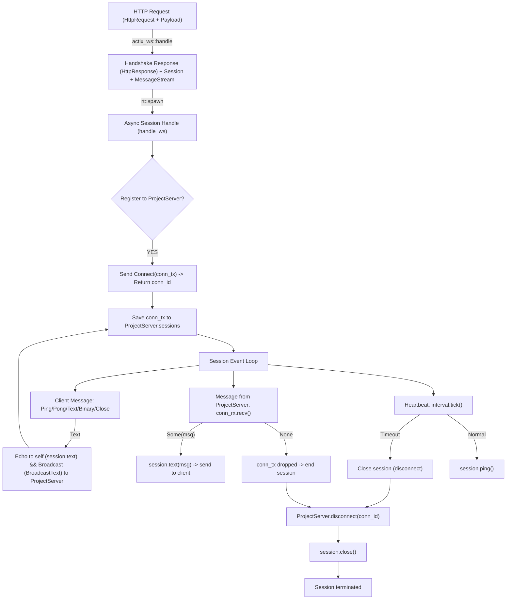
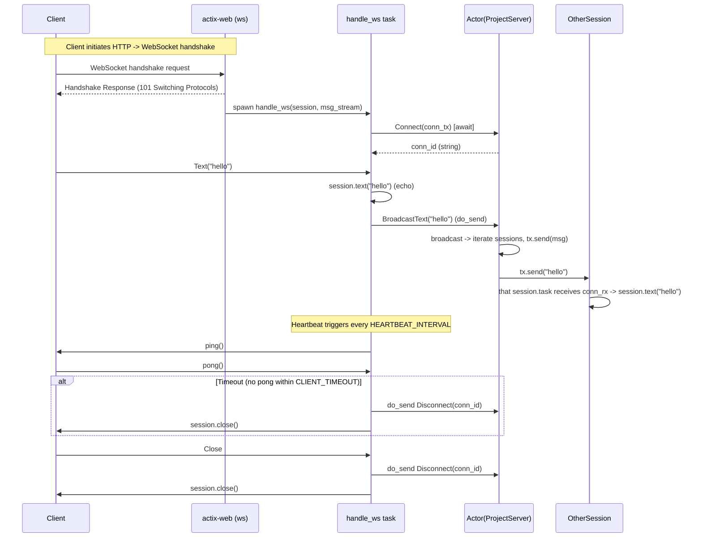

# Charts

## WebSocket Communication Flow

```mermaid
flowchart TD
  A["HTTP Request (HttpRequest + Payload)"] -->|actix_ws::handle| B["Handshake Response (HttpResponse) + Session + MessageStream"]
  B --> |rt::spawn| C["Async Session Handle (handle_ws)"]
  C --> D{Register to ProjectServer?}
  D -->|YES| E["Send Connect(conn_tx) -> Return conn_id"]
  E --> F[Save conn_tx to ProjectServer.sessions]
  F --> G[Session Event Loop]
  G --> G1[Client Message: Ping/Pong/Text/Binary/Close]
  G --> G2["Message from ProjectServer: conn_rx.recv()"]
  G --> G3["Heartbeat: interval.tick()"]
  G1 -->|Text| H["Echo to self (session.text) && Broadcast (BroadcastText) to ProjectServer"]
  G2 -->|"Some(msg)"| I["session.text(msg) -> send to client"]
  G2 -->|None| J[conn_tx dropped -> end session]
  G3 -->|Timeout| K["Close session (disconnect)"]
  G3 -->|Normal| L["session.ping()"]
  K --> M["ProjectServer.disconnect(conn_id)"]
  J --> M
  H --> F
  M --> N["session.close()"]
  N --> O[Session terminated]
```

## Sequence Diagram

```mermaid
sequenceDiagram
  participant Client
  participant ActixWeb as actix-web (ws)
  participant SessionTask as handle_ws task
  participant ProjectServer as Actor(ProjectServer)
  Note over Client,ActixWeb: Client initiates HTTP -> WebSocket handshake
  Client->>ActixWeb: WebSocket handshake request
  ActixWeb-->>Client: Handshake Response (101 Switching Protocols)
  ActixWeb->>SessionTask: spawn handle_ws(session, msg_stream)
  SessionTask->>ProjectServer: Connect(conn_tx) [await]
  ProjectServer-->>SessionTask: conn_id (string)
  Client->>SessionTask: Text("hello")
  SessionTask->>SessionTask: session.text("hello") (echo)
  SessionTask->>ProjectServer: BroadcastText("hello") (do_send)
  ProjectServer->>ProjectServer: broadcast -> iterate sessions, tx.send(msg)
  ProjectServer->>OtherSession: tx.send("hello")
  OtherSession->>OtherSession: that session.task receives conn_rx -> session.text("hello")
  Note over SessionTask: Heartbeat triggers every HEARTBEAT_INTERVAL
  SessionTask->>Client: ping()
  Client->>SessionTask: pong()
  alt Timeout (no pong within CLIENT_TIMEOUT)
    SessionTask->>ProjectServer: do_send Disconnect(conn_id)
    SessionTask->>Client: session.close()
  end
  Client->>SessionTask: Close
  SessionTask->>ProjectServer: do_send Disconnect(conn_id)
  SessionTask->>Client: session.close()
```
