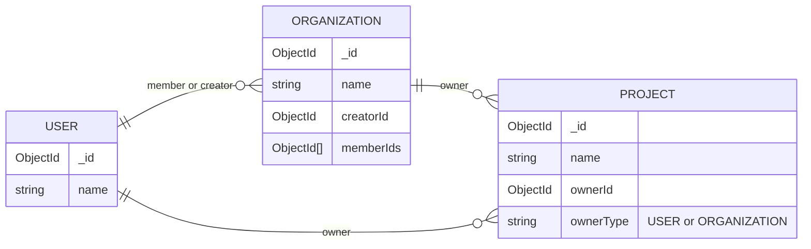

# Database Schema

> [!WARNING]
> This documentation will not be updated automatically. Please ensure to keep it in sync with the actual database schema.

## Diagram



See: [Entity Relationship Diagram Syntax](https://mermaid.nodejs.cn/syntax/entityRelationshipDiagram.html#relationship-syntax).

## Explanation

### `USER`

Represents an individual user in the system. Each user has a unique identifier (`_id`) and a `name` field.

### `ORGANIZATION`

Represents a group or organization that can have multiple users as members. Each organization has a unique identifier (`_id`), a `name`, a `creatorId` that references the user who created the organization, and an array of `memberIds` that contains the IDs of users who are part of the organization.

### `PROJECT`

Represents a project that can be owned by either a user or an organization. Each project has a unique identifier (`_id`), a `name`, an `ownerId` that references either a user or an organization, and an `ownerType` field that indicates whether the owner is a `USER` or `ORGANIZATION`.

<!-- ## MongoDB Queries

### Between `USER` and `ORGANIZATION`

#### Find organizations where a specific user is the creator

```go
userId := "USER_ID_HERE"
filter := bson.M{"creatorId": userId}
cursor, err := organizationCollection.Find(ctx, filter)
if err != nil {
    log.Fatal(err)
}
var orgs []Organization
if err = cursor.All(ctx, &orgs); err != nil {
    log.Fatal(err)
}
fmt.Println("Organizations created by user:", orgs)
```

#### Find organizations where a specific user is a member

```go
userId := "USER_ID_HERE"
filter := bson.M{"memberIds": userId}
cursor, err := organizationCollection.Find(ctx, filter)
if err != nil {
    log.Fatal(err)
}
var orgs []Organization
if err = cursor.All(ctx, &orgs); err != nil {
    log.Fatal(err)
}
fmt.Println("Organizations where user is a member:", orgs)
```

### Between `PROJECT` and `USER` / `ORGANIZATION`

#### Find projects owned by a specific user

```go
userId := "USER_ID_HERE"
filter := bson.M{"ownerId": userId, "ownerType": "USER"}
cursor, err := projectCollection.Find(ctx, filter)
if err != nil {
    log.Fatal(err)
}
var projects []Project
if err = cursor.All(ctx, &projects); err != nil {
    log.Fatal(err)
}
fmt.Println("Projects owned by user:", projects)
```

#### Find projects owned by a specific organization

```go
orgId := "ORG_ID_HERE"
filter := bson.M{"ownerId": orgId, "ownerType": "ORGANIZATION"}
cursor, err := projectCollection.Find(ctx, filter)
if err != nil {
    log.Fatal(err)
}
var projects []Project
if err = cursor.All(ctx, &projects); err != nil {
    log.Fatal(err)
}
fmt.Println("Projects owned by organization:", projects)
``` -->
