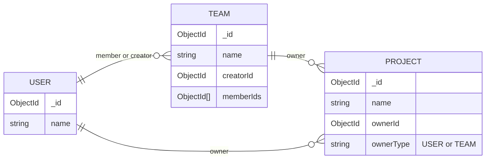

# Database Schema

> [!WARNING]
> This documentation will not be updated automatically. Please ensure to keep it in sync with the actual database schema.

## Diagram



See: [Entity Relationship Diagram Syntax](https://mermaid.nodejs.cn/syntax/entityRelationshipDiagram.html#relationship-syntax).

## Explanation

### `USER`

Represents an individual user in the system. Each user has a unique identifier (`_id`) and a `name` field.

### `TEAM`

Represents a group or team that can have multiple users as members. Each team has a unique identifier (`_id`), a `name`, a `creatorId` that references the user who created the team, and an array of `memberIds` that contains the IDs of users who are part of the team.

### `PROJECT`

Represents a project that can be owned by either a user or an team. Each project has a unique identifier (`_id`), a `name`, an `ownerId` that references either a user or an team, and an `ownerType` field that indicates whether the owner is a `USER` or `TEAM`.

<!-- ## MongoDB Queries

### Between `USER` and `TEAM`

#### Find teams where a specific user is the creator

```go
userId := "USER_ID_HERE"
filter := bson.M{"creatorId": userId}
cursor, err := teamCollection.Find(ctx, filter)
if err != nil {
    log.Fatal(err)
}
var teams []Team
if err = cursor.All(ctx, &teams); err != nil {
    log.Fatal(err)
}
fmt.Println("Teams created by user:", teams)
```

#### Find teams where a specific user is a member

```go
userId := "USER_ID_HERE"
filter := bson.M{"memberIds": userId}
cursor, err := teamCollection.Find(ctx, filter)
if err != nil {
    log.Fatal(err)
}
var teams []Team
if err = cursor.All(ctx, &teams); err != nil {
    log.Fatal(err)
}
fmt.Println("Teams where user is a member:", teams)
```

### Between `PROJECT` and `USER` / `TEAM`

#### Find projects owned by a specific user

```go
userId := "USER_ID_HERE"
filter := bson.M{"ownerId": userId, "ownerType": "USER"}
cursor, err := projectCollection.Find(ctx, filter)
if err != nil {
    log.Fatal(err)
}
var projects []Project
if err = cursor.All(ctx, &projects); err != nil {
    log.Fatal(err)
}
fmt.Println("Projects owned by user:", projects)
```

#### Find projects owned by a specific team

```go
teamId := "TEAM_ID_HERE"
filter := bson.M{"ownerId": teamId, "ownerType": "TEAM"}
cursor, err := projectCollection.Find(ctx, filter)
if err != nil {
    log.Fatal(err)
}
var projects []Project
if err = cursor.All(ctx, &projects); err != nil {
    log.Fatal(err)
}
fmt.Println("Projects owned by team:", projects)
``` -->
