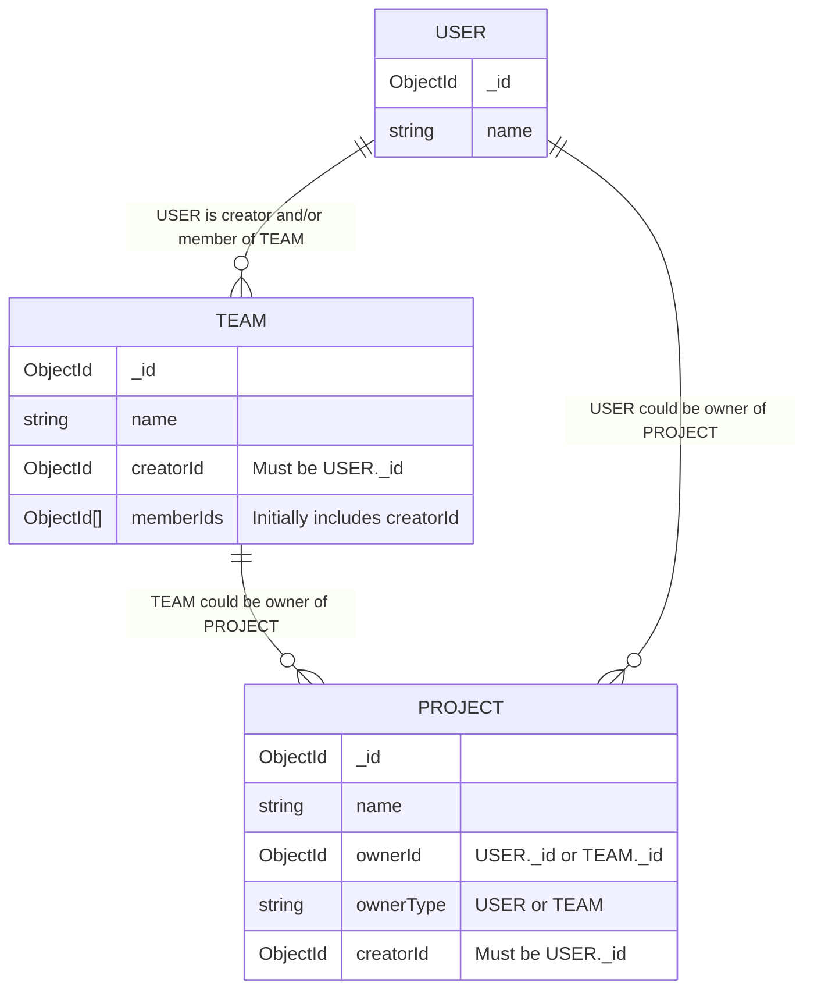

# Database Schema

> [!WARNING]
> This documentation will not be updated automatically. Please ensure to keep it in sync with the actual database schema.

## Diagram

See: [Entity Relationship Diagram Syntax](https://mermaid.nodejs.cn/syntax/entityRelationshipDiagram.html#relationship-syntax).

## Explanation

### `USER`

Represents an individual user in the system. Each user has a unique identifier (`_id`) and a `name` field.

### `TEAM`

Represents a team that can be created by a user and can have multiple members. Each team has a unique identifier (`_id`), a `name`, a `creatorId` that references the user who created the team, and a list of `memberIds` that reference users who are members of the team.

### `PROJECT`

Represents a project that can be owned by either a user or a team. Each project has a unique identifier (`_id`), a `name`, an `ownerId` that references either a user or a team, an `ownerType` that indicates whether the owner is a user or a team, and a `creatorId` that references the user who created the project.
