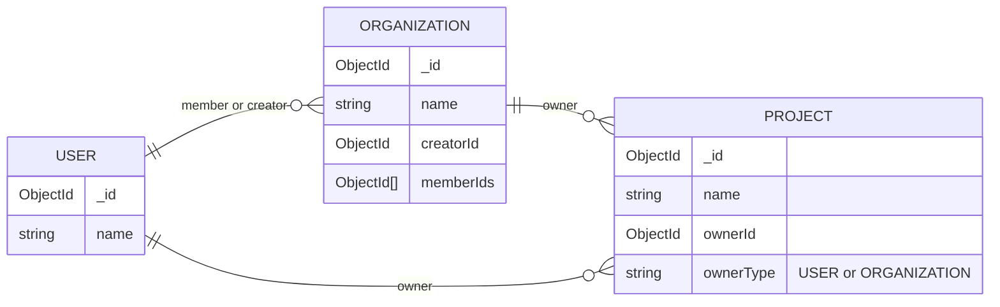

# Database Schema

## Diagram

See: [Entity Relationship Diagram Syntax](https://mermaid.nodejs.cn/syntax/entityRelationshipDiagram.html#relationship-syntax).

## Explanation

- `USER`: Represents an individual user in the system. Each user has a unique identifier (`_id`) and a `name` field.

- `ORGANIZATION`: Represents a group or organization that can have multiple users as members. Each organization has a unique identifier (`_id`), a `name`, a `creatorId` that references the user who created the organization, and an array of `memberIds` that contains the IDs of users who are part of the organization.

- `PROJECT`: Represents a project that can be owned by either a user or an organization. Each project has a unique identifier (`_id`), a `name`, an `ownerId` that references either a user or an organization, and an `ownerType` field that indicates whether the owner is a `USER` or `ORGANIZATION`.
