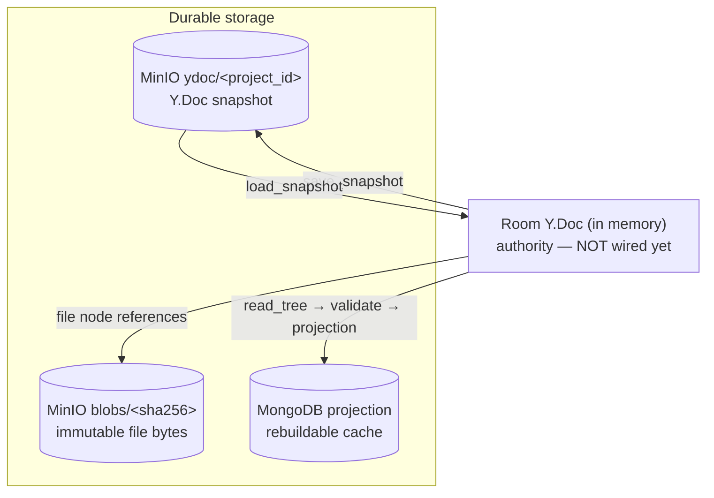

# Project Persistence — Data Model & Flow

How a project's file tree and bytes are modelled, stored, and moved between the
collaborative editor, the CRDT, and durable storage.

This documents the four foundation layers that are **implemented** today
(PRs building up `storage`, `models::tree`, `crdt`, `crdt::snapshot`). The
component that ties them together at runtime — the room **authority** in
`handler/ws.rs` — is **not wired yet**; where it belongs is called out below.

## The four layers

| Layer | Module | Responsibility | Depends on |
| --- | --- | --- | --- |
| **Byte storage** | `server/src/storage` | Persist bytes. Content-addressed blobs *and* mutable named objects. Backend-agnostic (`ObjectStore` trait; MinIO / in-memory impls). | — |
| **Domain model** | `server/src/models/tree` | The pure file tree: id-identity, path derivation, validation, projection. No CRDT, no I/O. | `storage::Blob` (type only) |
| **CRDT codec** | `server/src/crdt` | Encode/decode the tree to/from a Y.Doc `nodes` map, one CRDT cell per field. | `models::tree`, `yrs` |
| **Snapshot** | `server/src/crdt/snapshot` | Persist/restore a whole Y.Doc as bytes in object storage. | `storage`, `yrs` |

Each layer is independently unit-tested and unaware of the ones above it. The
dependency arrows only point downward, so the domain model never drags in `yrs`
and the codec never drags in a storage backend.

### 1. Byte storage — `ObjectStore`

Two kinds of object, deliberately separate primitives:

- **Content-addressed blobs** (`put`/`get`/`exists`/`delete`, keyed by SHA-256,
  stored at `blobs/{sha256}`). Immutable and deduplicated: identical bytes are
  one object. This is what makes **write-blob-before-reference** safe (upload the
  bytes, *then* record the hash on a node) and what a mark-and-sweep GC can
  reclaim.
- **Named objects** (`put_object`/`get_object`, arbitrary key). Mutable,
  overwritten in place. Used for Y.Doc snapshots (below). A blob is never
  overwritten — dedup and GC depend on that — so snapshots can't reuse the blob
  API.

`Blob { sha256, size }` is the durable reference a file node carries.

### 2. Domain model — `ProjectTree`

The tree as pure data: a `Node` is `id` + `parent` + `name` + `NodeContent`
(`File { blob }` or `Folder`). **id is identity; path is derived** by walking the
parent chain. `ProjectTree::validate` enforces every filesystem rule in one place
(legal names, sibling uniqueness, parent-is-a-folder, no cycles/over-depth);
`path_of` / `projection` derive paths and the flattened `NodeProjection` for
REST/Mongo. Knows nothing about CRDTs or storage — see
[the model's own docs](../server/src/models/tree.rs).

### 3. CRDT codec — `crdt`

The Y.Doc representation and the codec between it and `ProjectTree`:

```
nodes: Map<NodeId, Map{ kind, name, parent?, sha256?, size? }>
```

Each node is its own map and each field its own CRDT cell, so concurrent edits to
different fields of one node (the canonical rename-vs-move race) **merge** instead
of clobbering — which is why a node isn't stored as one opaque JSON blob.
`read_tree` decodes (no validation — the caller runs `validate`), `write_node` /
`write_tree` encode.

### 4. Snapshot — `crdt::snapshot`

Encodes a whole `Doc` as a single yrs update and stores it at the named key
`ydoc/{project_id}` (`save_snapshot`), or rebuilds a `Doc` from it
(`load_snapshot`). A room rehydrates from its snapshot on cold start rather than
re-seeding from stored text — re-inserting the same characters into a fresh CRDT
is what duplicates content on rejoin.

## Where the source of truth lives



- **`blobs/{sha256}`** is the source of truth for **file bytes**. Immutable.
- **`ydoc/{project_id}`** is the source of truth for **CRDT state** (the tree
  structure, and later the text overlay). The in-memory room Doc is the live
  copy; snapshots are its durable form.
- **MongoDB projection** is a **derived cache** — a list of `NodeProjection`
  (id, parent, name, derived path, blob) so REST listings and access checks
  don't have to load and decode a Y.Doc. It can be rebuilt from the snapshot at
  any time and is never authoritative.

## End-to-end flow

### Read (open a project / rehydrate a room)

1. `load_snapshot(store, project_id)` → `Doc`, or `None` for a brand-new project
   (which the authority seeds with an initial `main.typ`).
2. `read_tree(txn, nodes)` → `ProjectTree`.
3. `tree.validate()` → reject a corrupt/malformed snapshot; otherwise
4. `tree.projection()` feeds REST listings, and the Doc backs live collaboration.

Cheap listings skip steps 1–4 and read the Mongo projection directly.

### Write (a structural change — new/rename/move/delete)

1. A client mutates the Doc's `nodes` map (a CRDT update).
2. The **authority** decodes the resulting tree (`read_tree`) and `validate`s it.
   Illegal → reject/roll back; legal →
3. `save_snapshot` persists the new Doc state, and the Mongo projection is
   refreshed from `tree.projection()`.

### Write (file bytes — upload / edit-flushed-to-blob)

1. `store.put(bytes)` → `Blob { sha256, size }` — **blob written first**.
2. Only then is the hash recorded on the node (`NodeContent::File { blob }`) in
   the Doc. A crash between the two leaves an unreferenced (GC-able) blob, never
   a node pointing at bytes that were never written.

### Reclaiming bytes (GC — planned)

Deleting a node or replacing its bytes does **not** delete the blob (others may
share it). A periodic mark-and-sweep marks every sha reachable from live Docs +
retained snapshots and sweeps unreferenced `blobs/*` past a grace period.

## Not yet covered

- **Text overlay.** A file's editable text as a `Y.Text`, lazily materialized at
  open time and flushed back to a blob — a layer on top of this structural tree.
- **Room authority.** The `handler/ws.rs` rewrite that actually drives the flows
  above (decode → validate → snapshot → refresh projection) on each update.
- **GC** implementation, and snapshot **retention/compaction** (currently a
  single `latest` snapshot per project; no history).
