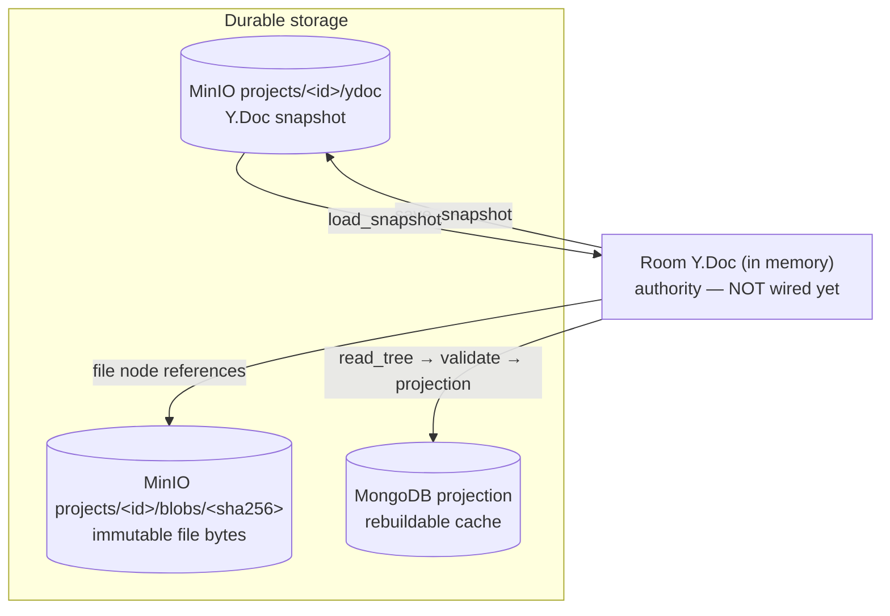

# Project Persistence — Data Model & Flow

How a project's file tree and bytes are modelled, stored, and moved between the
collaborative editor, the CRDT, and durable storage.

This documents the four foundation layers that are **implemented** today
(PRs building up `storage`, `models::tree`, `crdt`, `crdt::snapshot`). The
component that ties them together at runtime — the room **authority** in
`handler/ws.rs` — is **not wired yet**; where it belongs is called out below.

## The four layers

| Layer | Module | Responsibility | Depends on |
| --- | --- | --- | --- |
| **Byte storage** | `server/src/storage` | Persist bytes under a per-project prefix. Raw key/value backend (`ObjectStore` trait; MinIO / in-memory impls) with `ProjectStore` owning the layout on top. | — |
| **Domain model** | `server/src/models/tree` | The pure file tree: id-identity, path derivation, validation, projection. No CRDT, no I/O. | `storage::Blob` (type only) |
| **CRDT codec** | `server/src/crdt` | Encode/decode the tree to/from a Y.Doc `nodes` map, one CRDT cell per field. | `models::tree`, `yrs` |
| **Snapshot** | `server/src/crdt/snapshot` | Persist/restore a whole Y.Doc as bytes in object storage. | `storage`, `yrs` |

Each layer is independently unit-tested and unaware of the ones above it. The
dependency arrows only point downward, so the domain model never drags in `yrs`
and the codec never drags in a storage backend.

### 1. Byte storage — `ObjectStore` + `ProjectStore`

Everything a project owns lives under one key prefix, so the **project is the
storage boundary**:

```
projects/{project_id}/ydoc              # mutable Y.Doc snapshot
projects/{project_id}/blobs/{sha256}    # immutable, content-addressed bytes
```

Two layers keep concerns apart:

- **`ObjectStore`** is a dumb key/value backend — `put_object` / `get_object` /
  `delete_prefix` over opaque keys. It knows nothing about projects, blobs, or
  snapshots. MinIO in production, in-memory for tests.
- **`ProjectStore`** sits on top and owns the layout above: `put_blob` /
  `get_blob` (content-addressed *within* a project), `put_snapshot` /
  `get_snapshot`, and `delete_project`.

Blobs stay content-addressed within a project, so identical bytes in one project
share an object and **write-blob-before-reference** still holds (upload the
bytes, *then* record the hash on a node). There is **no cross-project sharing** —
the same bytes in two projects are two objects. That trade buys cheap project
deletion (a single `delete_prefix`, no reachability sweep) and obvious ownership
when browsing the bucket. `Blob { sha256, size }` is the durable reference a file
node carries.

### 2. Domain model — `ProjectTree`

The tree as pure data: a `Node` is `id` + `parent` + `name` + `NodeContent`
(`File { blob }` or `Folder`). **id is identity; path is derived** by walking the
parent chain. `ProjectTree::validate` enforces every filesystem rule in one place
(legal names, sibling uniqueness, parent-is-a-folder, no cycles/over-depth);
`path_of` / `projection` derive paths and the flattened `NodeProjection` for
REST/Mongo. Knows nothing about CRDTs or storage — see
[the model's own docs](../server/src/models/tree.rs).

### 3. CRDT codec — `crdt`

The Y.Doc representation and the codec between it and `ProjectTree`:

```
nodes: Map<NodeId, Map{ kind, name, parent?, sha256?, size? }>
```

Each node is its own map and each field its own CRDT cell, so concurrent edits to
different fields of one node (the canonical rename-vs-move race) **merge** instead
of clobbering — which is why a node isn't stored as one opaque JSON blob.
`read_tree` decodes (no validation — the caller runs `validate`), `write_node` /
`write_tree` encode.

### 4. Snapshot — `crdt::snapshot`

Encodes a whole `Doc` as a single yrs update and stores it as the project's
snapshot (`projects/{project_id}/ydoc`, via `ProjectStore`) with `save_snapshot`,
or rebuilds a `Doc` from it (`load_snapshot`). This module owns only the yrs
encode/decode; where the bytes live is `ProjectStore`'s concern. A room rehydrates
from its snapshot on cold start rather than
re-seeding from stored text — re-inserting the same characters into a fresh CRDT
is what duplicates content on rejoin.

## Where the source of truth lives


```mermaid
flowchart TB
  subgraph durable[Durable storage]
    blobs[("MinIO projects/&lt;id&gt;/blobs/&lt;sha256&gt;<br/>immutable file bytes")]
    ydoc[("MinIO projects/&lt;id&gt;/ydoc<br/>Y.Doc snapshot")]
    mongo[("MongoDB projection<br/>rebuildable cache")]
  end

  room["Room Y.Doc (in memory)<br/>authority — NOT wired yet"]

  room -->|save_snapshot| ydoc
  ydoc -->|load_snapshot| room
  room -->|read_tree → validate → projection| mongo
  room -->|file node references| blobs
```

- **`projects/{id}/blobs/{sha256}`** is the source of truth for **file bytes**.
  Immutable, content-addressed within the project.
- **`projects/{id}/ydoc`** is the source of truth for **CRDT state** (the tree
  structure, and later the text overlay). The in-memory room Doc is the live
  copy; snapshots are its durable form.
- **MongoDB `Project.tree`** is the id-keyed projection (id → parent, name,
  derived path, blob ref) so REST payloads and access checks don't have to load
  and decode a Y.Doc. It is refreshed from the snapshot on persist; it is also
  the **structure source for a cold start** (a project with no snapshot yet):
  the room is built from `tree` and its text rematerialized from blobs. There is
  no longer any inline-text `files` array — bytes live once, in blobs; structure
  lives in `tree`; the CRDT snapshot is the live/warm form of both.

## End-to-end flow

### Read (open a project / rehydrate a room)

1. `load_snapshot(store, project_id)` → `Doc`, or `None` for a brand-new project
   (which the authority seeds with an initial `main.typ`).
2. `read_tree(txn, nodes)` → `ProjectTree`.
3. `tree.validate()` → reject a corrupt/malformed snapshot; otherwise
4. `tree.projection()` feeds REST listings, and the Doc backs live collaboration.

Cheap listings skip steps 1–4 and read the Mongo projection directly.

### Write (a structural change — new/rename/move/delete)

1. A client mutates the Doc's `nodes` map (a CRDT update).
2. The **authority** decodes the resulting tree (`read_tree`) and `validate`s it.
   Illegal → reject/roll back; legal →
3. `save_snapshot` persists the new Doc state, and the Mongo projection is
   refreshed from `tree.projection()`.

### Write (file bytes — upload / edit-flushed-to-blob)

1. `store.put_blob(project_id, bytes)` → `Blob { sha256, size }` — **blob written
   first**.
2. Only then is the hash recorded on the node (`NodeContent::File { blob }`) in
   the Doc. A crash between the two leaves an unreferenced (GC-able) blob, never
   a node pointing at bytes that were never written.

### When a text file's blob is (re)flushed — `files.autoSave`

Every keystroke is already synced to the room over the CRDT and captured by the
periodic snapshot, so text is durable regardless of blob state. Minting a fresh
content-addressed **blob** from that text is a *separate*, coarser event, and
uploading one on every persist tick while someone types would spray a new MinIO
object per keystroke-burst (each immediately superseded and left for GC).

So the blob flush is **client-driven**, governed by a project-level
`files.autoSave` policy (mirroring VS Code) stored on `Project.settings`:

| Policy | Client flushes when… |
| --- | --- |
| `off` | only on a manual save (Ctrl/Cmd+S) |
| `afterDelay` | a debounce (`autoSaveDelay` ms) after the last edit |
| `onFocusChange` *(default)* | the focused file changes |
| `onWindowChange` | the window/tab loses focus |

The client detects the moment (only it knows about editor/window focus and
keystroke timing) and calls `POST /project/{id}/flush`, which sends the room a
forced flush (`Command::FlushRoom` → `persist_room(force_flush = true)`). The
plain persist tick never mints a blob; it only writes the snapshot + projection.
A room emptying on the last leave also force-flushes, so a final edit isn't left
in the snapshot alone. `blobs_pending` on the room short-circuits a flush when no
text has drifted from its recorded blob.

### Idle room eviction + text rematerialization

A room with no connections stays in memory (its `empty_since` clock starts). Once
it sits idle past `room_idle_secs`, the manager **evicts** it: it strips the
redundant text bytes from the resting snapshot and drops the room from memory,
reclaiming the in-memory `Y.Doc`.

- **Strip (`strip_text`).** For each text file whose overlay bytes already live
  in its blob (the overlay hashes to the node's blob sha), the overlay content is
  *deleted* from the doc. The resting snapshot then carries the structure and an
  *empty* overlay per file — not the text bytes, which now live once, in the blob.
  A file whose text hasn't settled to its blob is left intact (it keeps its bytes
  in the snapshot this cycle). The stripped snapshot is smaller by roughly the
  total text size.
- **Rematerialize (`rematerialize` → `Command::ApplyRemat` → `apply_remat`).** On
  the next join that *builds* the room, every empty overlay whose blob is
  non-empty is refilled: the blobs are fetched off-thread and their text inserted
  back into the overlays, then broadcast.

**Why this is safe (no duplication, no generation/versioning/reload).** The strip
is a CRDT *deletion*, so the emptied overlay carries a **tombstone** in the
snapshot. A client that was connected before the eviction and reconnects after it
receives that deletion on its initial sync (Yjs propagates deletes via the delete
set, even for items the client still holds live) — so its own copy of the text is
*removed*, and the rematerialized text (fresh items) is the only content left.
Old copy deleted + new copy inserted = the text once, on every peer. This is the
same invariant that lets a live room stay pinned rather than be re-derived from
text; the tombstone is what makes re-derivation safe here.

The 2× saving applies to **cold** (evicted) projects; a warm room, having
rematerialized, snapshots the full text again until its next eviction.

### Reclaiming bytes (GC)

- **Deleting a project** is a single `ProjectStore::delete_project` — a
  `delete_prefix` over `projects/{id}/`. No reachability analysis: the prefix
  *is* everything the project owns.
- **Reclaiming orphaned blobs within a live project** (a file's bytes changed or
  it was deleted, so the old blob is now unreferenced) still needs a mark-sweep —
  but scoped to that one project's `blobs/` prefix, marking every sha reachable
  from the live Doc + retained snapshot. This is planned, and only becomes
  relevant once the text overlay flushes edits to blobs.

## Not yet covered

- **Text overlay.** A file's editable text as a `Y.Text`, lazily materialized at
  open time and flushed back to a blob — a layer on top of this structural tree.
- **Room authority.** The `handler/ws.rs` rewrite that actually drives the flows
  above (decode → validate → snapshot → refresh projection) on each update.
- **GC** implementation, and snapshot **retention/compaction** (currently a
  single `latest` snapshot per project; no history).
